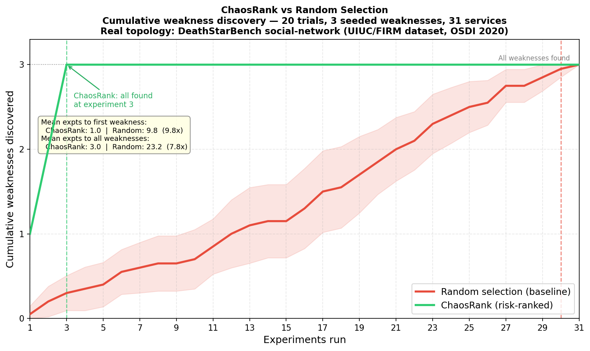

# ChaosRank

**Stop running random chaos experiments. Run the right one next.**


ChaosRank analyzes your service dependency graph and incident history to rank which service to break first — so your chaos experiments find real weaknesses instead of wasting cycles on low-risk services.

```
Rank  Service                    Risk   Blast  Fragility  Suggested Fault     Confidence
1     composepost-uploadcreator  0.888  0.907  0.860      latency-injection   medium
2     composepost-uploadmedia    0.866  0.907  0.805      latency-injection   medium
3     urlservice-upload          0.770  0.669  0.922      latency-injection   low
4     composepost-uploadurl      0.738  1.000  0.341      pod-failure         low
5     nginx-compose-post         0.200  0.000  0.393      pod-failure         low
```

---

## The Problem

Chaos engineering teams face a prioritization problem: given a system with 20+ microservices, which service should you break first?

Today the answer is gut feel, "whatever failed last week", or random selection. None of these are principled. A payment service with 15 downstream dependents is not the same risk as an internal logging sidecar — but most teams treat them identically.

**Core framing:** `risk = impact × likelihood`

- **Blast radius** estimates impact — how many services are affected if this one fails?
- **Fragility** estimates likelihood — based on incident history, how probable is degradation?

ChaosRank estimates both, combines them, and tells you which service to target next.

---

## Results

Evaluated on the **DeathStarBench social-network topology** (31 services) from the UIUC/FIRM dataset (OSDI 2020). Three high-risk services were identified as weaknesses based on structural importance and anomaly injection history.



| Metric | ChaosRank | Random | Improvement |
|---|---|---|---|
| Mean experiments to first weakness | 1.0 | 9.8 | **9.8x** |
| Mean experiments to all weaknesses | 3.0 | 23.2 | **7.8x** |

ChaosRank found all 3 weaknesses in exactly 3 experiments across all 20 trials. Random selection needed 23.2 experiments on average.

> **Methodology note:** Service topology and incident data are derived from the UIUC/FIRM DeathStarBench dataset (CC0 license). The topology reflects real microservice call graphs. Incident data was extracted by comparing per-service latency in anomaly-injected trace files against the no-interference baseline (~7x degradation → critical severity). This is a simulation benchmark — ChaosRank does not inject faults itself.

---

## How It Works

### Risk Score

```
risk(service) = alpha * blast_radius(service) + beta * fragility(service)
```

Default: `alpha=0.6, beta=0.4`. Blast radius is weighted higher because a stable-but-critical service is more dangerous to ignore than an unstable leaf — its failure would be high-impact and potentially surprising.

### Blast Radius — Blended Centrality

```
blast_radius(v) = 0.5 * pagerank(v, G) + 0.5 * in_degree_centrality(v, G)
```

Built from your Jaeger trace data. PageRank captures transitive influence (how far does failure propagate?). In-degree centrality captures direct dependents (what breaks immediately?). Neither alone is sufficient — the blend surfaces both shallow-wide hubs and deep dependency chains.

### Fragility Score — Four-Step Pipeline

1. **Traffic-aware burst deduplication** — collapses alert storms proportionally to traffic volume, preserving genuine failure cascades
2. **Per-incident traffic normalization** — each incident evaluated in its own traffic context, preventing high-traffic services from being unfairly penalized
3. **Exponential decay** — recent incidents weighted more heavily (`lambda=0.10` → ~30-day effective memory)
4. **Z-score normalization** — outlier services score high without collapsing all others toward zero (MinMax rejected for this reason)

Severity weights use a log scale: `critical=1.000, high=0.602, medium=0.301, low=0.100`.

See [docs/algorithm.md](docs/algorithm.md) for the full mathematical derivation.

### Fault Type Suggestion

| Dominant Signal | Suggested Fault | Confidence |
|---|---|---|
| p99 latency spike | `latency-injection` | high if purity >70% and n ≥ 5 |
| error rate breach | `partial-response` | high if purity >70% and n ≥ 5 |
| timeout incident | `connection-timeout` | medium if purity >50% and n ≥ 3 |
| no history | `pod-failure` | low (cold start default) |
| mixed/unclear | `pod-failure` | low (conservative default) |

---

## Installation

```bash
pip install chaosrank-cli
# or isolated install (recommended)
pipx install chaosrank-cli
```

**Requirements:** Python 3.11+

### From source

```bash
git clone https://github.com/Medinz01/chaosrank
cd chaosrank
pip install -e ".[dev]"
```

### Docker

```bash
docker compose build
docker compose run chaosrank
```

---

## Usage

### Basic ranking

```bash
chaosrank rank \
  --traces ./traces.json \
  --incidents ./incidents.csv
```

### JSON output

```bash
chaosrank rank \
  --traces ./traces.json \
  --incidents ./incidents.csv \
  --output json
```

### Pipe directly to LitmusChaos

```bash
chaosrank rank \
  --traces ./traces.json \
  --incidents ./incidents.csv \
  --output litmus | kubectl apply -f -
```

### Visualize the dependency graph

```bash
chaosrank graph \
  --traces ./traces.json \
  --output dot | dot -Tpng > graph.png
```

---

## Input Formats

### Traces — Jaeger JSON

Standard Jaeger HTTP API export format. Export from your Jaeger instance:

```bash
curl "http://jaeger:16686/api/traces?service=frontend&limit=5000" > traces.json
```

ChaosRank streams files >100MB via `ijson` to avoid memory issues.

### Incidents — CSV

```csv
timestamp,service,type,severity,request_volume
2026-02-10T08:00:00Z,payment-service,error,critical,9000
2026-02-14T15:00:00Z,productcatalog-service,latency,high,12000
2026-02-20T11:00:00Z,cart-service,error,medium,5000
```

| Column | Required | Description |
|---|---|---|
| `timestamp` | Yes | ISO 8601 |
| `service` | Yes | Service name (normalized automatically) |
| `type` | Yes | `error`, `latency`, `timeout` |
| `severity` | Yes | `critical`, `high`, `medium`, `low` |
| `request_volume` | No | Per-service request count at incident time. Falls back to window average, then skips normalization with warning. |

---

## Configuration

**`chaosrank.yaml`** (place in working directory or pass via `--config`):

```yaml
weights:
  blast_radius: 0.6   # alpha — blast radius weight
  fragility: 0.4      # beta  — fragility weight

fragility:
  decay_lambda: 0.10          # recency decay (0.05=60d, 0.10=30d, 0.20=15d)
  burst_window_minutes: 5     # base alert dedup window

graph:
  min_call_frequency: 10      # filter noisy edges

output:
  top_n: 5

# Optional: service name aliases
aliases:
  payments: payment-service
  auth: authentication-service
```

### Tuning `alpha` and `beta`

| Scenario | Recommendation |
|---|---|
| New system, no incident history | Increase `alpha` (blast radius only) |
| Mature system with rich incident data | Decrease `alpha`, increase `beta` |
| Signal misalignment warning fires | Review — blast radius and fragility are disagreeing. Inspect both signals before tuning. |

---

## Service Name Normalization

OTel exporters often emit versioned or hashed service names. ChaosRank normalizes automatically:

```
payment-service-v2-7d9f8b  →  payment-service
payment-service-1.2.3      →  payment-service
Payment-Service-v2-abc12f  →  payment-service
```

Pipeline: lowercase → strip version patterns → strip pod hash suffixes → apply aliases.

---

## Prior Art & Positioning

| Tool | Experiment Selection | Gap |
|---|---|---|
| LitmusChaos | Manual, declarative CRDs | No ranking or guidance |
| Chaos Mesh | Manual workflow definition | No risk awareness |
| Gremlin | UI-driven, some "advice" | Closed source, not graph-based |
| Steadybit | Reliability hints (rule-based) | No dependency graph, no incidents |
| ChaosEater | LLM-driven hypotheses | Non-deterministic, not reproducible |

ChaosRank does not claim novelty in any individual technique. The contribution is the combination of graph-theoretic blast radius scoring, per-incident traffic-normalized fragility scoring, and their application to chaos experiment prioritization. This combination is an open problem in OSS chaos engineering tooling.

---

## Known Limitations

| Limitation | Impact | Status |
|---|---|---|
| Async dependencies (Kafka, SQS, etc.) | Ranking inversion risk — async callees appear as zero-dependent | Warning emitted at startup. `--async-deps` flag planned for v0.2 |
| Jaeger JSON only | Narrow input support | OTel OTLP planned for v0.2 |
| Single-region topology | Misses cross-region blast radius | Future work |
| Static alpha/beta | Optimal weights vary by system | Future: learned weights |
| Z-score less stable below 10 services | Directional scores only | Documented |
| Point-in-time request volume | Requires enriched incident CSV | Falls back gracefully |

### Async dependency blindspot

ChaosRank builds its dependency graph from synchronous trace spans. Services that produce to Kafka topics, SQS queues, or other async channels **do not appear as dependents** in trace data. A Kafka producer with 10 downstream consumers will show zero blast radius.

If your architecture is heavily event-driven, manually verify top-ranked services against your async dependency maps. The `--async-deps` flag (v0.2 roadmap) will accept a manifest describing async relationships.

---

## What ChaosRank Is Not

- **Does not inject faults** → use LitmusChaos, Chaos Mesh, or Gremlin
- **Does not derive steady-state** → bring your own Prometheus thresholds
- **Does not verify results** → check your dashboards or Steadybit
- **Does not need a running cluster** → offline analysis on trace exports
- **Does not support OTel OTLP v1** → explicitly v0.2 roadmap

---

## Benchmark Reproduction

```bash
# Convert DeathStarBench traces to ChaosRank format
python benchmarks/convert_deathstar.py \
  --app social-network \
  --data-dir /path/to/tracing-data \
  --output benchmarks/real_traces/social_network.json

# Extract incidents from anomaly injection files
python benchmarks/extract_incidents.py \
  --app social-network \
  --data-dir /path/to/tracing-data \
  --output benchmarks/real_traces/social_network_incidents.csv

# Run 20-trial comparison
python benchmarks/run_comparison.py

# Generate chart
python benchmarks/plot_results.py
```

Dataset: Qiu et al., *FIRM: An Intelligent Fine-grained Resource Management Framework for SLO-oriented Microservices*, OSDI 2020.
DOI: [10.13012/B2IDB-6738796_V1](https://doi.org/10.13012/B2IDB-6738796_V1) — CC0 license.

---

## Development

```bash
# Run tests
pytest tests/ -v

# Lint
ruff check chaosrank/

# Run with verbose logging
chaosrank rank --traces traces.json --incidents incidents.csv --verbose
```

### Test coverage

| Suite | Tests | What it validates |
|---|---|---|
| `test_fragility.py` | 21 | Burst dedup, per-incident normalization, fragility preservation, z-score, decay |
| `test_blast_radius.py` | 15 | Callee model, chain ordering, blend weights, graph reversal |
| `test_ranker.py` | 18 | Risk math, cold start, combined signal, fault suggestion |
| `test_parser.py` | 53 | Normalization round-trip, incident parsing, Jaeger edge extraction |

The fragility preservation test is load-bearing for the benchmark: it asserts that a medium-traffic service with disproportionately high incident rate ranks above a high-traffic service with proportional incidents — the case that post-hoc normalization gets wrong.

---

## Repository Structure

```
chaosrank/
├── chaosrank/
│   ├── cli.py                    # Typer entrypoint
│   ├── parser/
│   │   ├── normalize.py          # Service name normalization
│   │   ├── jaeger.py             # Jaeger JSON trace parser
│   │   └── incidents.py          # Incident CSV parser
│   ├── graph/
│   │   ├── builder.py            # NetworkX DiGraph construction
│   │   ├── blast_radius.py       # Blended centrality scoring
│   │   └── visualize.py          # DOT/Graphviz export
│   ├── scorer/
│   │   ├── fragility.py          # Four-step fragility pipeline
│   │   ├── ranker.py             # Risk score combination
│   │   └── suggest.py            # Fault type suggestion
│   └── output/
│       ├── table.py              # Rich table renderer
│       ├── json_out.py           # JSON output with reasoning
│       └── litmus.py             # LitmusChaos ChaosEngine manifest
├── tests/                        # 107 tests
├── benchmarks/
│   ├── convert_deathstar.py      # DeathStarBench → Jaeger JSON converter
│   ├── extract_incidents.py      # Anomaly traces → incident CSV extractor
│   ├── run_comparison.py         # 20-trial benchmark
│   ├── plot_results.py           # Discovery curve chart
│   └── real_traces/              # Converted DeathStarBench data
├── docs/
│   ├── algorithm.md              # Full mathematical derivation
│   ├── architecture.md           # Component map and data flow
│   └── future-work.md            # v0.2 roadmap
├── chaosrank.yaml                # Default configuration
├── pyproject.toml
└── Dockerfile
```

---

## Contributing

See [CONTRIBUTING.md](CONTRIBUTING.md) for setup, testing, and PR guidelines.

## Documentation

- [docs/algorithm.md](docs/algorithm.md) — full mathematical derivation
- [docs/architecture.md](docs/architecture.md) — component map and data flow
- [docs/future-work.md](docs/future-work.md) — v0.2 roadmap

## Changelog

See [CHANGELOG.md](CHANGELOG.md) for version history.

## License

MIT — see [LICENSE](LICENSE) for full text.